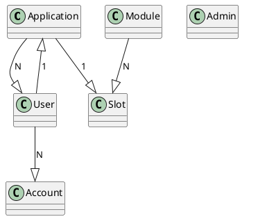

# Database reference

This document covers supported database technologies, authentication mechanisms, database schema and recommendations.

The target audience of this document are developers, system administrators and database administrators.

The application static configuration file options to connect to the database are out of scope of this document. Please, check [the configuration reference](./configuration.md){:target="_blank"} for details about the application static configuration.

## Supported database technologies

The application supports [PostgreSQL](https://www.postgresql.org/){:target="_blank"} as the database technology.

!!! note

    SQLite is also supported but just for testing purposes.

## Authentication mechanisms

User credentials (user and password) is the supported authentication mechanism for PostgreSQL. There are several password-based authentication methods in PostgreSQL, but ``scram-sha-256`` is the most secure one of them and therefore the one recommended to use. This configuration should be done on the server.

In addition to the above-mentioned authentication mechanism and even though it is a challenge-response scheme that prevents password sniffing on untrusted connections, the signare also supports SSL/TLS connections so that all the traffic between the client and the server is sent encrypted.

More precisely, the application supports the following SSL modes:

- **disable**: TLS mode is disabled.
- **require**: TLS mode is enabled, but no certificate validation is done.
- **verify-ca**: TLS mode is enabled, check the certificate chain up to a trusted certificate authority (CA).
- **verify-full**: TLS mode is enabled, check certificate chain and verify server host name matches its certificate. This is the most secure one.

The signare currently does not support custom locations for specifying the CA certificate, so if adding non-public or untrusted certificates, they must be installed to the operating system’s trusted chain. This is operating system specific.

## Encryption

The application does not store HSM slot PINs. A slot records the name of the file holding its PIN (see [`pinSourceDirectory`](./configuration.md#softhsm-configuration)), and the value is read from that file at login time.

The `pin` column of `cfg_hardware_security_module_slot` has been dropped.

**Every PKCS#11 (SoftHSM) slot must resolve its PIN from a source before upgrading to this release.** There is no fallback: such a slot with no `pinSource` fails every signing request until one is set, and Signare cannot recover the PIN for you. Migration `000005` checks this before it drops anything, so a deployment that has not moved its slots fails the upgrade instead of losing the credential.

AKV and Local Key Vault deployments have nothing to do here. Those modules never authenticated with this column, the API refuses a `pinSource` on them, and they keep signing whether or not one is set. A stray value on such a slot is discarded rather than treated as a credential, and the migration does not check them.

The intended path is to move every PKCS#11 slot to a pin source on the release that introduced them, using `admin.slots.updatePinSource`, which verifies each source against the HSM before storing it. Upgrading across both releases in one step is supported but slower: the guard refuses, and each slot has to be moved by hand with the SQL below, without that verification.

A refusal surfaces as `signare upgrade` exiting with a panic carrying SQLSTATE `P0001` and the message above. `000004` has already committed by then, so the database is left with `pin_source` added and `signare_migrations` at version 5, marked dirty.

**Do not recover by rolling back to a release older than the one that introduced pin sources.** Once any slot has been created or moved to a source by that release or this one, its `pin` is NULL, and the older mappers read the column into a plain string, so every slot read fails with `converting NULL to string is unsupported`, a module-wide listing included. Running the older `signare upgrade` afterwards panics either way: with the dirty flag still set it refuses the dirty version, and with the flag cleared it sees a version beyond its own step list, takes the downgrade branch and panics on an out-of-range step. Reverting migration `000005` does not help, because it restores the column empty. Recover forward, with the steps below.

If the upgrade is refused, recover with SQL rather than through the API. The API route needs a release that already has `admin.slots.updatePinSource`, which the release you are upgrading from may not have:

1. List the slots still holding a PIN. **This prints the PINs to your terminal**, so do it on a trusted console and clear the scrollback afterwards:

    ```sql
    SELECT s.id, s.pin
    FROM cfg_hardware_security_module_slot s
    JOIN cfg_hardware_security_module m ON m.id = s.hardware_security_module_id
    WHERE m.kind = 'SoftHSM' AND s.pin IS NOT NULL AND s.pin <> '' AND s.pin_source = '';
    ```

2. For each one, write that PIN into a file in the configured `pinSourceDirectory`, owned by the user Signare runs as and created with mode `0400`, then name the file on the slot:

    ```sql
    UPDATE cfg_hardware_security_module_slot SET pin_source = '<file name>' WHERE id = '<slot id>';
    ```

3. Reset the migration version, not just the dirty flag:

    ```sql
    UPDATE signare_migrations SET version = 4, dirty = false;
    ```

    `signare upgrade` refuses to run while a version is marked dirty. Clearing only the flag leaves the version at 5, and the upgrade then treats step 5 as already applied: it logs `nothing to migrate` and **exits successfully without dropping the column**. Resetting the version to 4 is what re-runs the step.

4. Run `signare upgrade` again.
5. Confirm the column is gone. This is the check that distinguishes a real upgrade from the `nothing to migrate` case above, which reports success either way:

    ```sql
    SELECT column_name FROM information_schema.columns
    WHERE table_name = 'cfg_hardware_security_module_slot' AND column_name = 'pin';
    ```

    It must return no rows.

6. Run `admin.slots.verifyPinSource` on each slot you fixed by SQL. Setting `pin_source` directly skips the check against the HSM that the admin API performs, so this is where a wrong file name or a wrong PIN surfaces.

**Any PIN written before the column was dropped must be rotated on the token.** Dropping a column in PostgreSQL only updates the catalog, so the value stays in the existing heap tuples until those rows are rewritten; `VACUUM FULL cfg_hardware_security_module_slot` or `pg_repack` does that. Even then the value survives in WAL archives and in every backup taken while it was stored, which is why rotation on the token, not this migration, is what actually retires a PIN.

The database still holds Local Key Vault private key material, and Local Key Vault is not for production use. In addition to using a secure SSL mode for the connection between the application and the database server, we recommend using encryption at rest. Please, refer to the Data Partition Encryption section of PostgreSQL's encryption options [documentation](https://www.postgresql.org/docs/current/encryption-options.html){:target="_blank"}.

## Schema

The signare doesn't use database foreign keys. It's the application's logic that manages relations between tables/resources.

### Resources relations

In order to better understand the relationship between signare resources you can take a look at this diagram depicting them: 


<figure markdown="span">

  <figcaption>signare resources relationship diagram</figcaption>
</figure>

