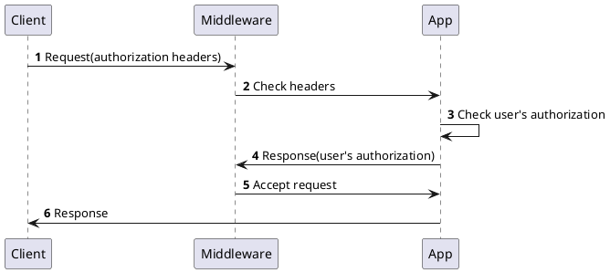

# Security 

This document provides an overview of controlling access to the signare REST API and JSON RPC API.

The target audience of this document is a user that wants to know more about the architecture of the application.

Out of the scope of this guide are explanations about how to configure an external authentication layer.

## Introduction

Before diving into the security architecture of the application, it is very important to differentiate between two crucial concepts: 

- **Authentication**: Verifies the identity of a client.
    - Answers the question *"Who are you?"*
    - Examples: passwords, biometrics, certificates...

- **Authorization**: Controls actions permitted for authenticated entities.
    - Answers the question *"What are you allowed to do?"*
    - Access based on permissions or roles.

## Authentication

The signare relies on external authentication systems in order to support integration with the client’s chosen authentication mechanism. 
The authentication system provides an extensible way to collect user and application data to contextualize the requests.

The diagram below displays a `security gateway` as an abstraction of the security layer that provides authentication (either service, commercial or custom):

<figure markdown="span">
  
  <figcaption>signare security architecture diagram</figcaption>
</figure>

### Deployment requirements

The security gateway is not an optional layer of the diagram. The signare performs no authentication of
its own: it reads the caller's identity from the `X-Auth-UserId` and `X-Auth-ApplicationId` request
headers and trusts what it finds. Anything that can reach a signare listener can therefore name any
user, including the signer administrator, with no credential at all.

A deployment must satisfy all of the following:

1. **The signare is not reachable except through the gateway.** `--listen-address` defaults to
   `127.0.0.1` for this reason. Widening it puts the API within reach of every host that can route to
   the address, and the signare logs a startup warning when it is not loopback.
2. **The gateway authenticates every caller** before forwarding the request.
3. **The gateway sets the `X-Auth-*` headers from the verified identity, and strips any the client
   sent.** A gateway that forwards a client-supplied `X-Auth-UserId` authenticates nobody, regardless of
   how it authenticated the connection.

A TLS sidecar or a service mesh satisfies the first requirement only as far as its policy restricts
who may connect. Mutual TLS authenticates the gateway, not the caller, so requirements 2 and 3 still
have to be met by whatever terminates the request.

## Authorization

Users access the signare by making HTTP requests to its APIs. When a request reaches the API, the middleware have to authorize the access. 
The diagram below illustrates the authorization process:

<figure markdown="span">

  <figcaption>Authorization via HTTP header sequence diagram</figcaption>
</figure>

The table below describes the authorization header keys for every request: 

| Name                     | Value type | Description                           |
|--------------------------|------------|---------------------------------------|
| **X-Auth-UserId**        | string     | ID of the signare's user        |
| **X-Auth-ApplicationId** | string     | ID of the signare's application |

!!! note 
    Not all API endpoints require the `X-Auth-ApplicationId` header keys, that information depends on the role based access configuration of the signare.

Once an HTTP request reaches the signare as described in the step 1, the authorization process continues as follows:

1. In the step 2 the middleware validates if the header keys are present in the user's HTTP request.
2. In the steps 3 the middleware validates if the [configuration of the Role Based Access Control (RBAC)](rbac.md) authorizes user to perform the request.
3. In the steps 5 the middleware authorizes the user's request and then delivers it to the business logic layer.

!!! note
    If the middleware does not authorize the request, the server will respond with a `403` HTTP status code. 
